# Chapter 0 - Railway 101

(skip this if you are a railfan)

## Railway History

### Where it begins...

So, what is railway? Well, if you just see the surface, it is just some wood sticks lying under two steel rails. But I think maybe let's look back at its history.

In the past, we need to move something very heavy, and we don't really want to break our backs for sure. Then, someone came up with an idea: what about build a "way" for them? Yes, they did. But that's not railway in its modern concept. Later some guy just brings something new from a boiled kettle, and somebody find out this black thing, which we call them coal, can work as a source of energy. And we need to transport them, probably inventing something powered by such thing, and some guy named George Stephenson did that. Train was born.

> Well, actually... he invented locomotive, train's name came later, if you are interested, Google can help you to figure out the difference between these two words.

Ok, later we think this can also transport people, so we build carriages. And now railways are extending, population is growing as industrialization begins, we need more trains to transport, and then more, then more, then... Oh, looks like we just let two trains crash into each other, there are no more spaces now, and we shouldn't let them kiss each other's butt for sure. What shall we do?

### The Almighty Power of ~~Illuminati~~ Your Eyes

Eyes on the road! This is what we always heard when we are driving cars, right? Yes, they think the same. How about just let the drivers see the road all the time, and breaks when it notices something. Yes, this works at beginning, but later we think trains are too slow, let's speed it up, and load more things, and become more heavier... Oh, now you need 800 meters to stop this thing, because someone in history whose head got hit by an apple (at least rumor said that) said,

> Every object perseveres in its state of rest, or of uniform motion in a right line, except insofar as it is compelled to change that state by forces impressed thereon.

An easier version:

> The heavier you are, the longer distance you need to stop.

I think maybe this picture can help you understand:

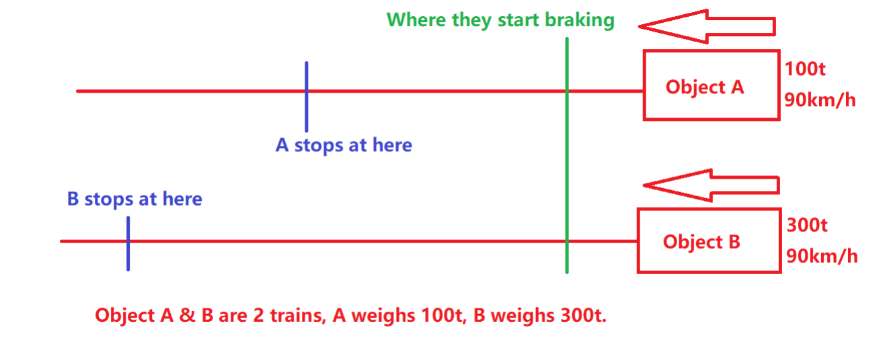

**Fig. 0-1-1:** Newton 1st Law simplified

So, we need longer distance to stop, but can human eyes actually see that far? Well, no. And sometimes this happens:

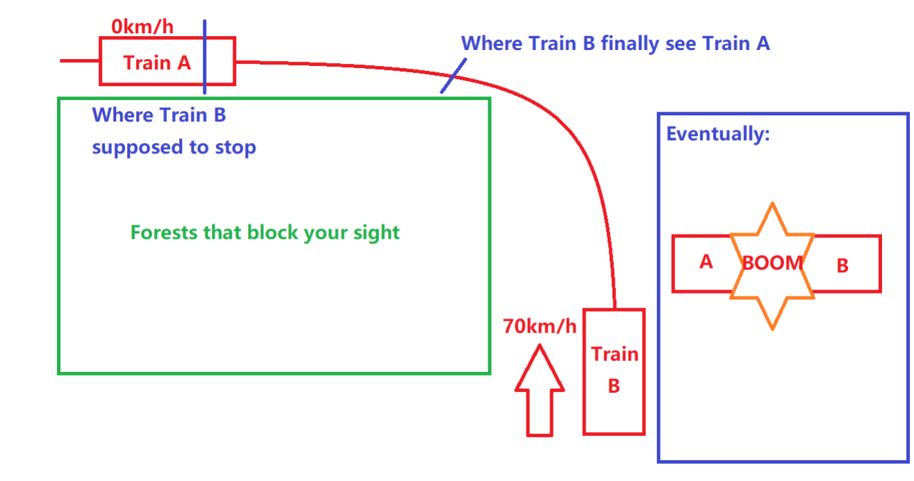

**Fig. 0-1-2:** A crash caused by driving on sight

### Watch your time

Then, is there any other way to complete such task? Well, we don't only have one crew on the train. Maybe we can test their ability for running, that's what we did at first. Like:

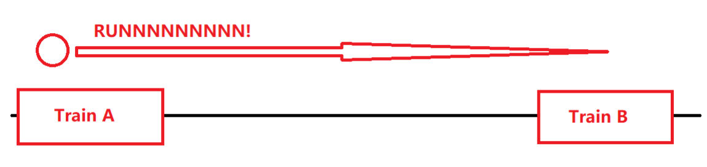

**Fig. 0-1-3:** One with superpower! (Nope, one doesn’t)

But you know, not all of us can become sportsman, and you cannot just jump off a train without getting hurt. How about record average running time, and then let trains to depart according to it? Yep, they did this:

We measure the average time you need to run from Train A to Train B. Let’s assume it would take around *t* minutes for a person to finish the run. And we let two trains depart at different time with the interval of *t* minutes. For example, if one train departs at 12:35, we will let the next train departs at 12:35+*t*. Just like the picture shown in the next page.

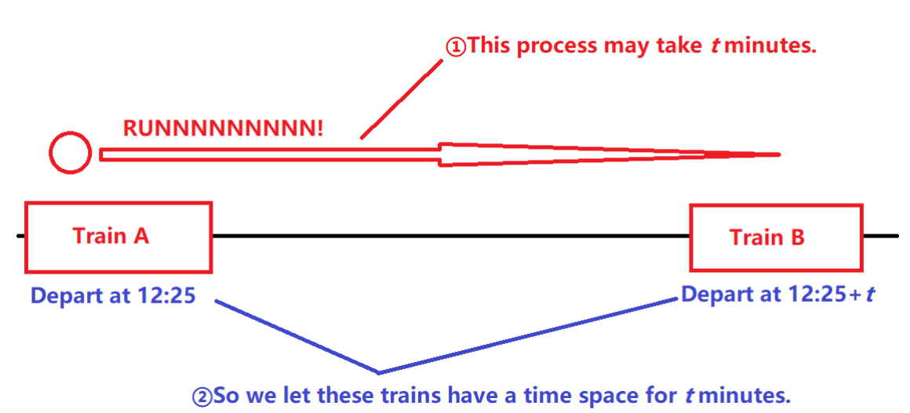

**Fig. 0-1-4:** Time interval

But sometimes, such thing may happen:

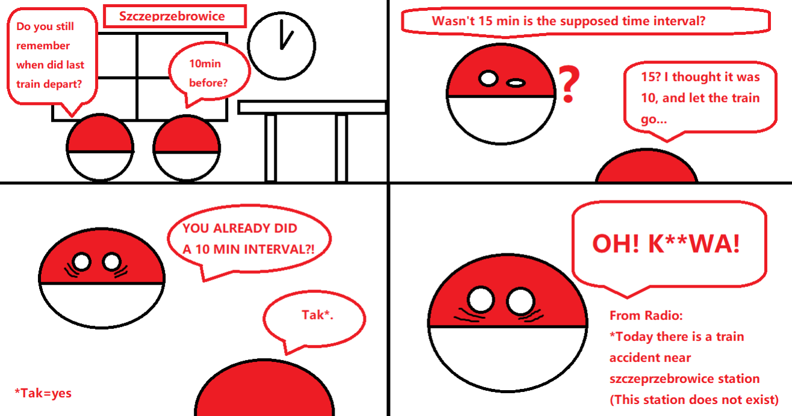

**Fig. 0-1-5:** A comic for some operation failure

You see, it’s a not news that people sometimes would forget to do something, and most of time, we wouldn’t ask others until we find out we have messed something up. Just like in this case, sometimes people forgot the exact time interval they are supposed to operate.

And actually, even people in these days would sometimes take a nap when they are working, not to mention that time. And when a signaler fell asleep, such thing would happen just like the comic on the next page:

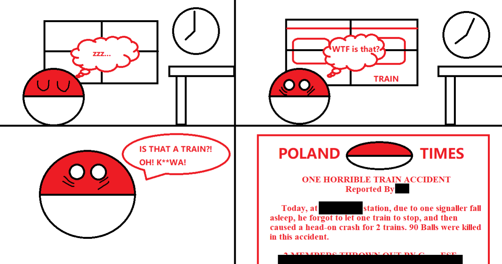

**Fig. 0-1-6:** When one man falls asleep

Also, we need more trains as people were born so quickly after many cities were built. Adding trains is good, but not good if they started to kiss each other again. So, we need a new way to do that.

### Time to Block!

So... Instead of time, there is another thing can be used to make some separation - distance. But then there is another problem: railways are not always straight, there are some curves and turning points. Well, maybe we can try this thing?

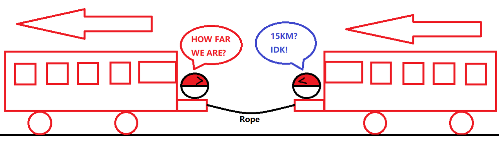

**Fig. 0-1-7:** Why directly measure the distance is stupid?

Well, no. First, we don't have rulers that long. Second, we don't have one guy who can shout loud enough for a person to hear from over 10km away. Also, as mentioned before, railways are not always straight lines, they have curves. So, we cannot just directly let two guys measuring the distance of trains all the time. We need another way.

So, what would you do when you will let someone far away know where you are? In modern days, we just use Internet, send a message and here we go. At that time, there is no such thing, but we do have telegraphs. And they cannot be something portable for sure. So, we need to do this.

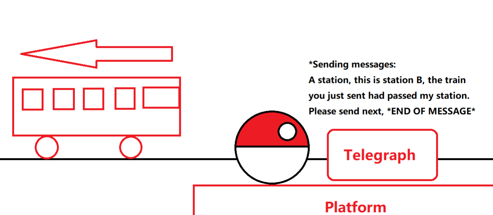

**Fig. 0-1-8:** Report train position using telegraphs

And then, signalers need to be responsible for trains. Because, they allowed another train to enter the section they are in charge. And through this procedure, we only let one train to enter such section. This is what we called "block" in railway transportation. We blocked the way for other trains until one train leaves a certain section. And we create sections by diving the whole route into different parts.

So, now we can operate like this:

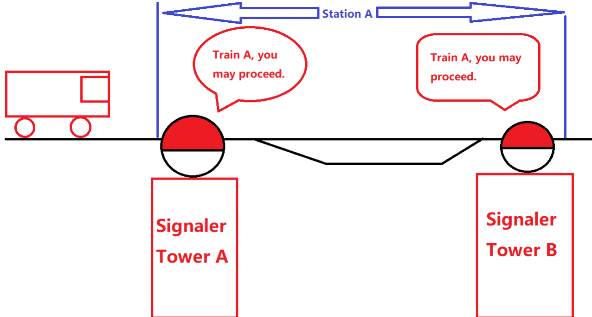

**Fig. 0-1-9:** Normal situation for signaler dispatching a train

And this can also prevent some situations like:

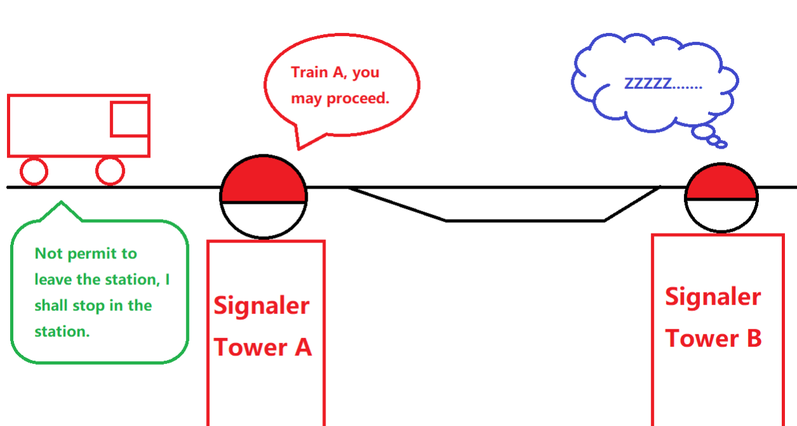

**Fig. 0-1-10:** When one signaler fell asleep...

### Say Hello to Signals!

There is another thing to consider: trains are moving, and we don't have phones at that time, so how are we supposed to tell drivers what to do? Well, we use our hands.

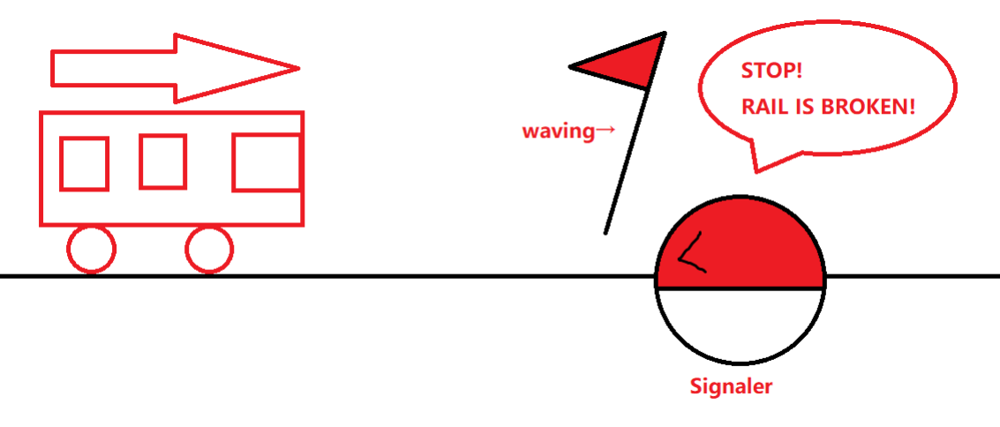

**Fig. 0-1-11:** Hand signals

But then there is another problem. We cannot just let guys standing 24/7 for giving signals, unless you are operating ***the Gulag Railway***. So, we need something to help out such situation. So, we invent signals. Just like traffic lights, we first hang different colors of lamps to make it shine.

Well, if you have opened your room lights in daylight, I guess you already know what would be the problem - they're way too invisible when sun is shining everywhere. We need something more obvious to show the signals. And then one guy come up with an idea: Hey, what about using some boards? Yes, we did, they are called semaphore signals.

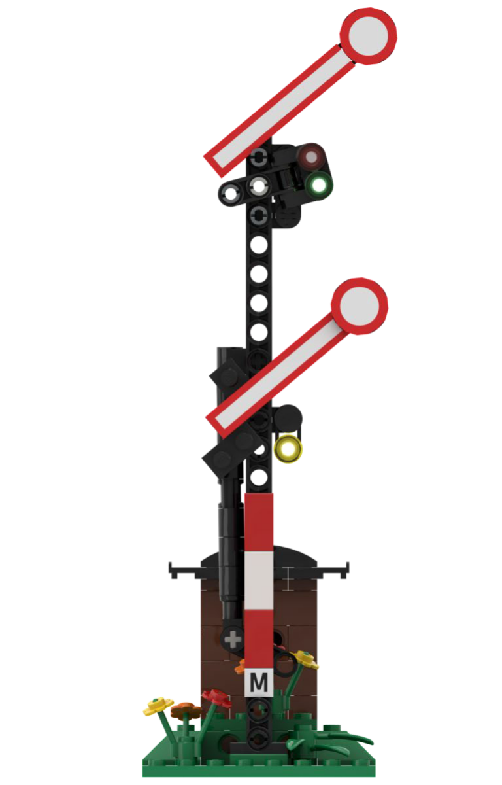

**Fig. 0-1-12:** One example of German Semaphore Signal (By Dr. Matthias Runte)

Give a close look, you can also see there are lamps there, which is the foundation of railway signals you see today. Later we find out electricity is more powerful, so we removed the lamps and replaced them with bulbs.

### Tell you in Advance

Ok, now we have signals, there must be less accidents, right? Well, at first, yes. But later, there are more tracks in one station, and when they need to enter sidings (side-tracks), they had some speed-limit. So, something like this happened:

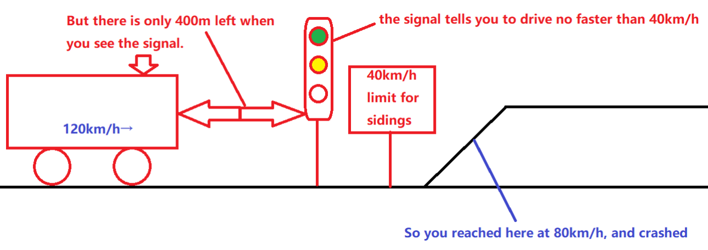

**Fig. 0-1-13:** Problems for sidings

Then somebody came up with an idea, "What if we tell the driver to slow down in advance, when they reached last signal?" Yes, they did. We call such signal as **distant signal**.

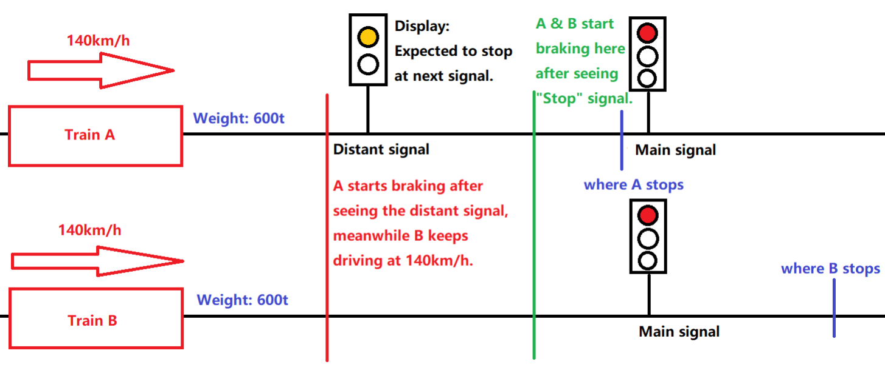

**Fig. 0-1-14:** How distant signals work

Now we meet the end of this chapter. We will further more explore each concept in the followings.

## Blocks, Signals, Interlocks

Ah... where are we? Yes, we invent blocks. But I think you already noticed one point: all these protections are only available for trains running in the same direction. But, trains need to come back, so we need other methods.

### Blocks & Interlocks

#### Blocks Updated

A way to solve this problem is to build another railway beside it, which we call it double-track. So, the only thing left is to decide which side of the track the trains shall run on. Britain and other countries influenced by Britain (like China, Japan...) run on the left-side. Meanwhile, others decide to run on the right-side, like Germany and America.

Yes, it did work, but we cannot just always build a second railway beside what we have already. It's too much money and sometimes the environment won't allow us. In the past, people use timetables to let a train stopped at one station. But if you always watch YouTube, and listen to a famous song joking about a very famous railway company in Europe, you know when you hear:

> Sis Trein is ät se moment... 10 minits diläit
>
> (This train at this moment is 10 minutes delay, just imitating the thick accent. Apologize for German-speaking community)

A message like above is pretty destructive for such timetable-based operation. Because if one train got delayed, another need to wait, and another, and another, after a chain reaction, the total delay might reach 1 hour or even 10 hours.

We said we use telegraph to do some block operations before, right? Yes, and we continue to do such thing, now it's in 3 steps: request (ask for permission) - depart (set up the block) - arrival (release the block). This can be done in the following pictures depicting the whole situation.

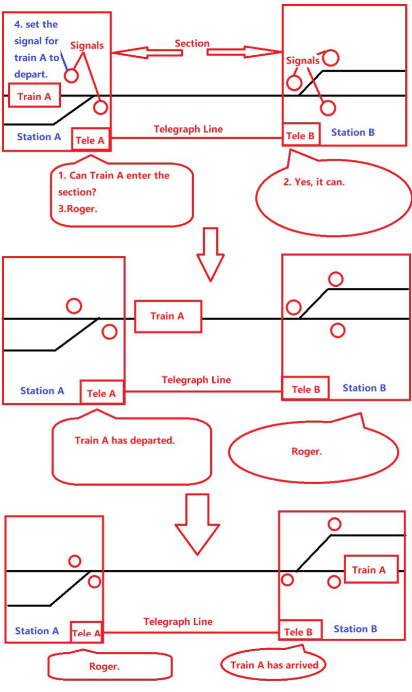

**Fig. 0-1-15:** The whole process of block operation

And for double-track, as we usually define the common running direction, we can omit the first procedure. Later, some guy invented telephones, and we use them instead. But hey, won't people still make some mistakes like what previous said? Yes, they still did...

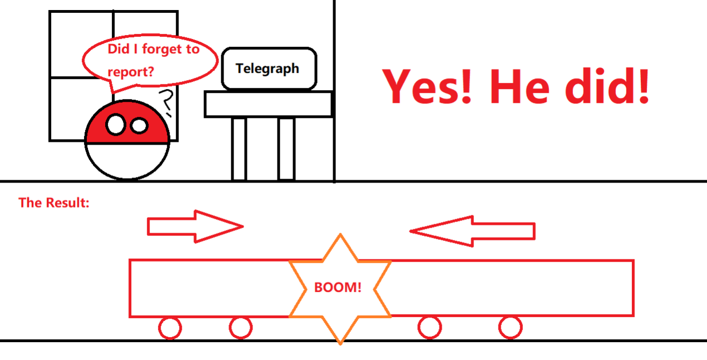

**Fig. 0-1-16:** Accidents still happen

Well, time to update...

#### Machine Power

So, introducing **Block Instruments**, getting tired of always forgetting records? Use it, we use circuits and **connecting it to signals** to make sure you won't give a green signal when a train is in the block!

And later, we connect all turnouts, related signals, and block instruments to make **interlock**. This thing worked as followings:

> When you set a route for a train to go, all signals and turnouts related would be adjusted together and locked, so you won't move any of it until you cancel the route or the route is released after the train passed. And when a train passed the signal, it would automatically turn red to avoid another train to follow.

A short summary is: this is safer because you are not allowed to let a second train enter the block.

Later, we developed all kinds of interlock devices to help us dispatch more easily. The block operation mentioned in previous section was simplified too. Now, we use block instruments for releasing/setting the blocks, meanwhile we still need to transport other information by humans, so we give a name "semi-auto block system" to it.

#### Automation Era

Have you ever thought about a question: is there a fixed distance between two stations? Not really, sometimes two stations can be 50km away from each other. Then, if we just let only one train to enter this long distance, that is surely low-efficient. Here let's just focus on double-track railways, as single-track railways are another story.

So, we divided them into shorter sections. But, like what is said before, unless you are operating some Gulag Railways, we simply cannot just let too many people stand at the boundaries of two small divided sections all the time. What can be done to improve it?

Well, we simply just make it more automatic. This can be done by adding some detectors on the track to tell train's current location, and connecting them with signals using circuits. This is called **track circuit**. Below is one of the earliest types of how it looks like, and a simplified version of what we currently use.

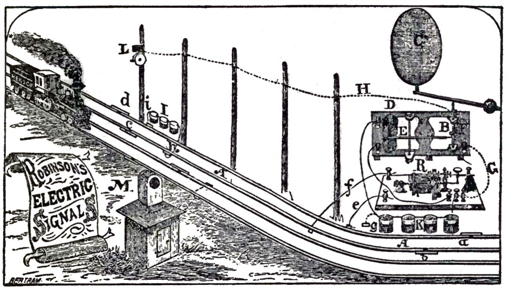

**Fig. 0-1-17:** Illustration of track circuit invented by William Robinson in 1872

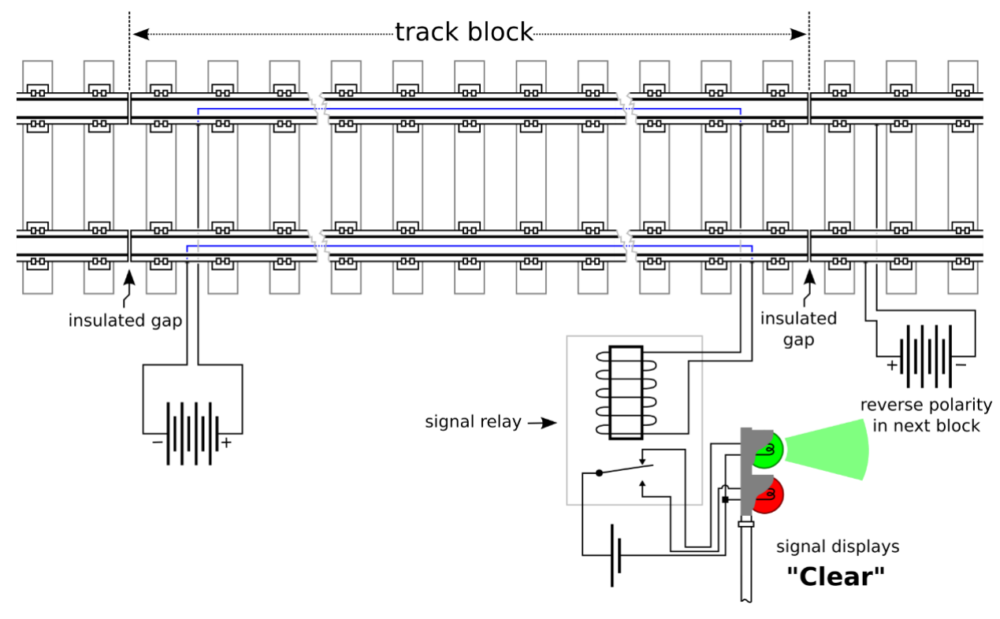

**Fig. 0-1-18:** A simplified version of track circuit nowadays

Later, some countries decide to use axle counter, a mono-functional device to detect train location.

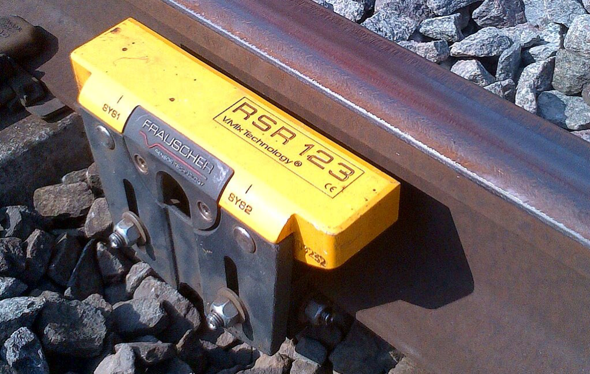

**Fig. 0-1-19:** An axle counter in UK, by Carlos118

So, that brings the end of the block section, let's go to signals.

### Signals

#### A Basic Division

We have repeated the word **signals** for many times, but we didn't give a detailed description. We use all kinds of signals at the boundary of two blocks, and also we add distant signals to create enough long distance for train to brake and stop.

So, now let's look at another point we didn't mention before - in a station. We usually don't have only one track in a station, so there are turnouts to help the train to change a track. But of course, change a track bring another speed limit, just like you won't be able to take a sharp turn when you are driving at 100km/h in a car.

There are two different thoughts on how to deal with this problem: one is to tell driver **"which route you are going to drive"**, the other is **"which is the safe speed for the route you are going to drive"**. This difference brings us the two basic categories of railway signaling.

#### Which route you are going to drive?

If we want to answer in this way, we apply **route signaling**. This is the earliest solution for such situation, but now only a few countries use it, mainly: Britain, Japan, North Korea, South Korea, and China. The following picture grabbed from British railway rulebook RS521 can help you understand:

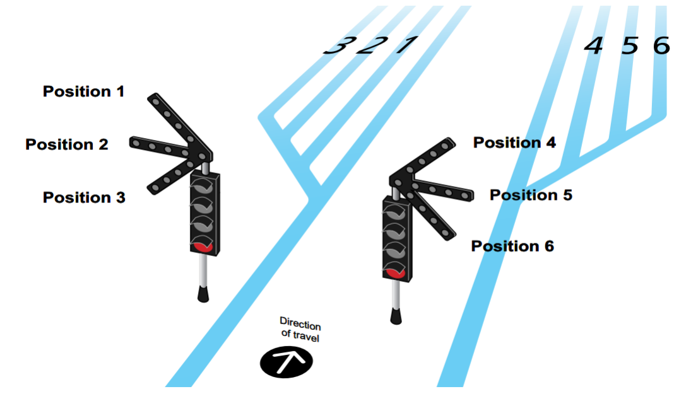

**Fig. 0-1-20:** Route signaling, excerpt from British railway rulebook RS521

#### Which is the safe speed for the route you are going to drive?

If we answer it in this way, we apply **speed signaling**. This is a further development based on route signaling, so it appears much later. But now it is widely applied all over the world, the representative is Germany. Poland also applied speed signaling, so we will focus on speed signaling in the following sections. Below is a excerpt from German railway rulebook RW301, this can help you understand speed signaling.

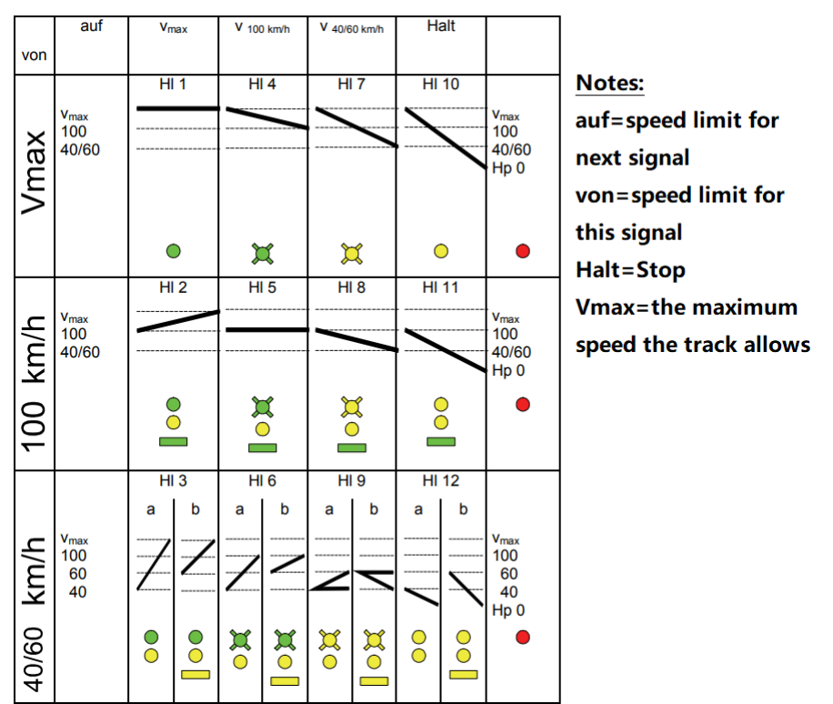

**Fig. 0-1-21:** Speed signaling, excerpt from German railway rulebook RW301

From this point, you have already learned enough knowledge on railway operations. Let’s get started with a more detailed look on Japanese railways.