# Chapter 1 - An Introduction to the Japanese Railways

So, welcome aboard. I guess for many players not from East Asia, it is easy to encounter so many issues. And some operation ideas on this “oriental” land may already confuse you very much. Therefore, I think before going into the exact controls, it is important to at least know some basic knowledge.

## Signals

### Basics

The first thing you may feel confused is the signal aspects. Basically, it tells the route you are going to enter, as mentioned in Chapter 0. And it also tells you the train ahead of you is how many blocks away from you.

Basically, we can summarize it into Fig. 1-1-1.

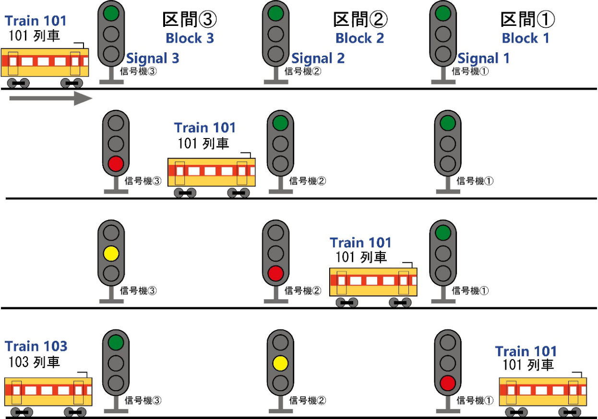

**Fig. 1-1-1:** How signal works basically

(Original picture from: https://www.suna.co.jp/blog/2024/03/-9.php)

But in real life, we have more various aspects to show where the train ahead actually is. In this game, you will encounter the display listed on the next page.

**Table 1-1-1:** Signal aspects in the game

| Tei-shi | Kei-kai | Chū-i | Gen-so-ku | Shin-kō |
|---|---|---|---|---|
| 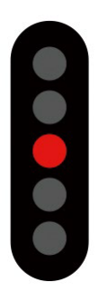 | 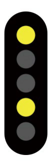 | 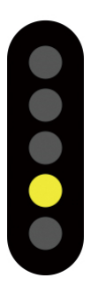 | 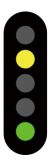 | 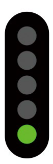 |
| Stop | Restricted speed | Caution | Reduced speed | Proceed |
| Do not pass! Or you will crash! | Prepare to stop at next signal, a train is just ahead of you. | Same as Kei-kai. They indeed have some differences, but it’s unnecessary to point out here. | Next signal expected to be Kei-kai or Chū-i | Just go! |

In one picture:

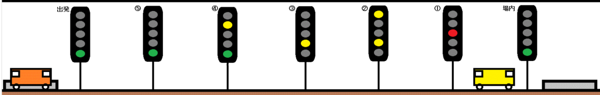

**Fig. 1-1-2:** Actual aspects display (by Radicaltrain on Wikipedia)

### Deeper Dive

Now you may find out there are two extra signals in Fig. 1-1-2. And you also observe some weird oriental symbols that may appear in some horror movies written beside them. That’s our next topic, the categories of signals.

Basically, the two words you see, if you actually check the glossary listed before contents page, you will know those two stands for “departure” (left one) and “entrance” (right one). We need these two to tell drivers whether it is allowed to depart from a station or enter.

Sometimes you may see many departure signals combined together. We will talk about it in the next section to avoid sudden difficulty change.

Now, as mentioned in Chapter 0, sometimes we cannot see a signal since it is put between something blocking our views. In this case, we may use repeaters to let drivers learn the signal ahead earlier. The repeaters look like this:

**Table 1-1-2:** Repeaters

|  | Shin-kō | Sei-gen | Tei-shi |
|---|---|---|---|
| | 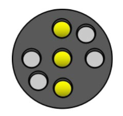 | 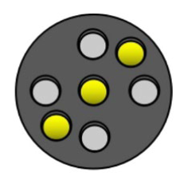 | 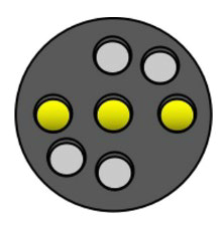 |
| Meaning | Proceed | Restricted | Stop |
| Signal Aspects | Proceed | Gen-so-ku, Chū-i or Kei-kai. | Stop |

Some American players may shout out, “Hey! I saw this in Pennsylvania!” Yes, that is the original one.

### Beating Lernaean Hydra

When you search about Japanese railway signals, some pictures as shown below must have caught your eyes.

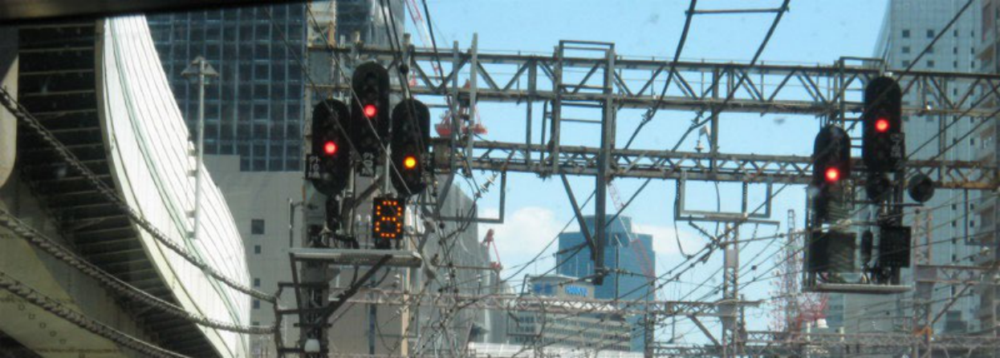

**Fig. 1-1-2:** Entrance signals crazy version (from hatena blog user big_brother)

*WHY THERE ARE SO MANY SIGNALS! HOW I CAN KNOW WHICH TO LOOK AT? THIS IS INSANE!*

Yeah, basically I think you may already shout out like this. But do not panic now. You may recall that, Japanese railway signals are supposed to tell drivers which route or track they should drive next. This is the actual case, just instead of using those funky British 45-degree light lines, we use individual signals. (Those actually still exists in Japan, just it is fewer than this way)

Let’s look at the easiest case before go into crazy ones.

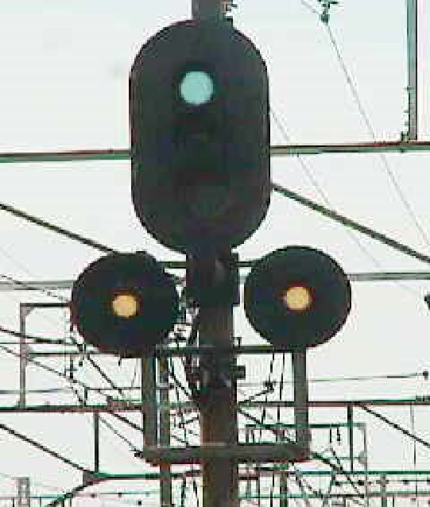

**Fig. 1-1-3:** A simple case (from isok.jp)

Generally, the display can be described as Fig. 1-1-4.

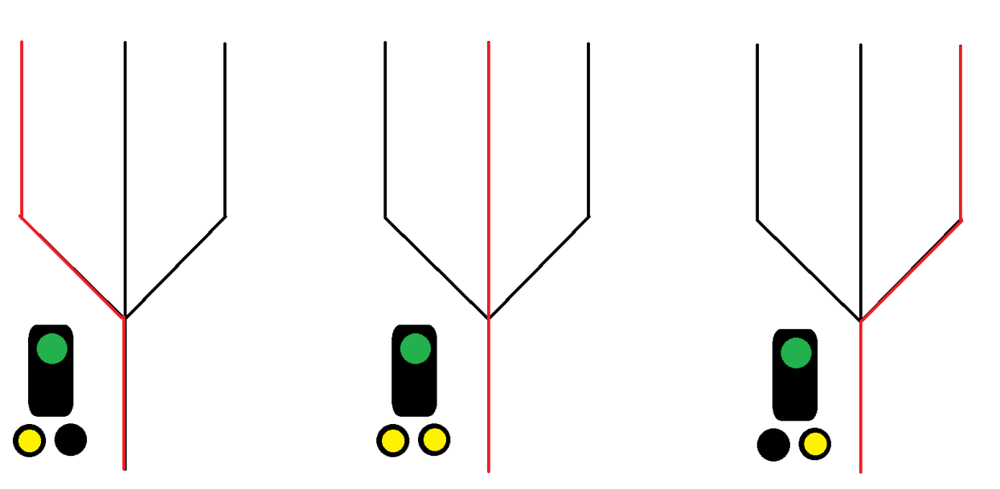

**Fig. 1-1-4:** How it works (the easiest case)

Such device is used to tell the driver which route the train is going to next in advance. Therefore, this is called *Shin-ro-yo-ko-ku-ki* (“distant signals for routings”). And then, we need to talk about the exact signal placed at the diverging point, which is called *Shin-ro-hyou-ji-ki* (“signals used to display routings”).

The easiest one is as shown in Fig. 1-1-5.

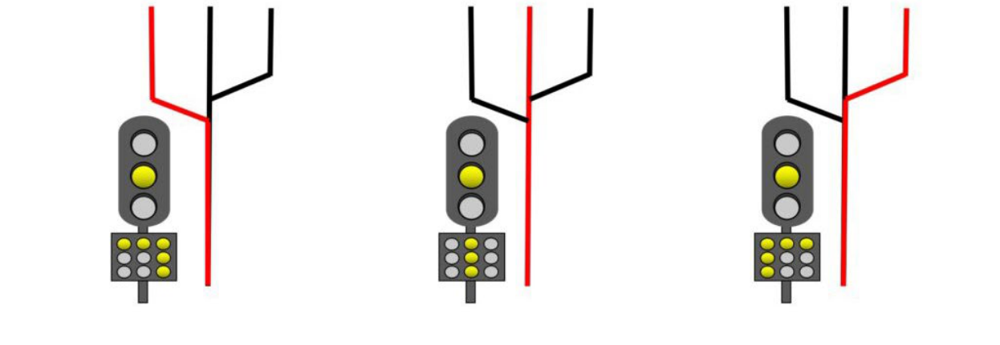

**Fig. 1-1-5:** A simple case for 3 tracks (from https://brikin10nblog.com/)

However, not all diverging point has 3 tracks. Sometimes it has only 2 or more than 3 tracks. Therefore, we still need other types of signals to show it, as shown in Fig. 1-1-6.

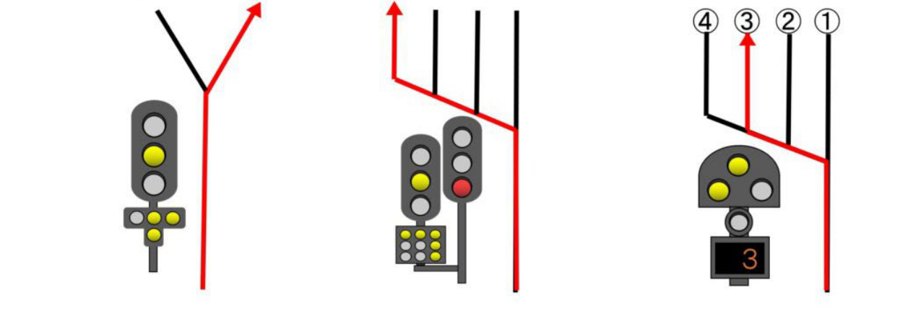

**Fig. 1-1-6:** Other cases (from https://brikin10nblog.com/)

You may notice in the middle, there is not only one signal above the route indicator. This is also a common practice. So, now we are truly beating Lernaean Hydra. At the beginning of this part, we already see some crazy combinations of multiple signals together. Yes, that is what we are talking about next, using signals to show one train’s next route.

Actually, it is not that crazy as it may seem. It can be described as Fig. 1-1-7.

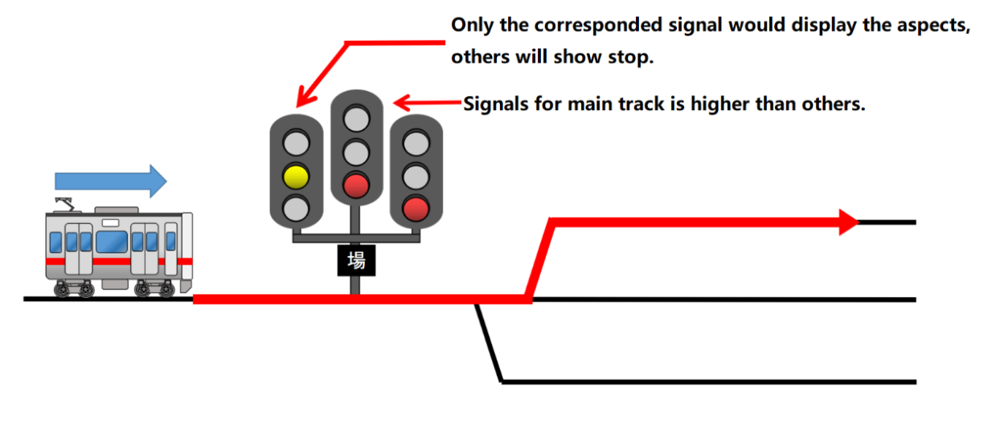

**Fig. 1-1-7:** Multiple signals case (from https://brikin10nblog.com/)

## Know Your Limit

Alright, now time to talk about another thing: speed limit. When we are driving on the road, we need speed limit. So does a train. Someone who got hit by an apple according to rumors told us, if you drive too fast on a curve, you can do a roll over and exhibit your bogies to others, like Richard Hammond.

Just like you see some number written in a red circle as a sign for speed limit (or some board writing SPEED LIMIT “NUMBER”), on Japanese railways, the most common speed limit board is like Fig. 1-1-8.

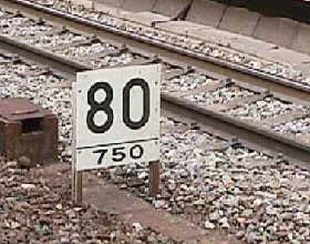

**Fig. 1-1-8:** Common speed limit sign (from isok.jp)

80 here is showing the speed limit is 80 km/h, and 750 means the length of this speed limit affects, 750m. Please remember we Asians never use that cursed mph, we use km/h. And, we don’t use weird stuff like foot, yard, or anything, we use meters. I know some Americans and British may have hard time calculating, just get used to it.

However, this is only the basic form of speed limit signs. It actually has various variants, but here I will only discuss about things you may encounter in the game.

We have turnouts to let trains go another track, but turnouts also require speed limit. However, it should not apply to those trains will not switch tracks, right? Therefore, we add two triangles to show this only applies to those who will go through the turnout. And two triangles will correspond to the direction of turnouts.

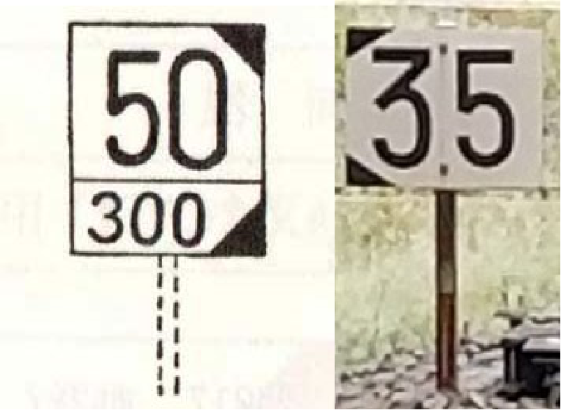

**Fig. 1-1-9:** Speed limits only applies to turnouts

(From: haisenryakuzu.net & blog.kys-honpo.com)

And we need a sign to tell drivers when the speed limit ends. So we use Fig. 1-1-10 to tell.

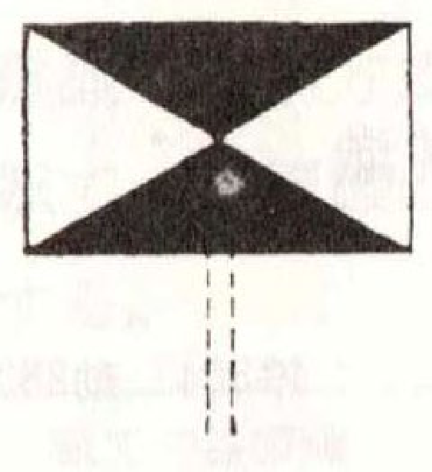

**Fig. 1-1-10:** Cancellation of speed limit (from haisenryakuzu.net)

However, not all trains have the same length, and it would be a disaster if we need to put so many same signs just for the sake of different trains. Therefore, we use such plates in game (Fig. 1-1-11) to tell trains with different length when it is safe to accelerate.

**Fig. 1-1-11:** The sign to tell you the place speed limit is actually cancelled

Where can I find my exact length of my train? Or let’s just say, how I know how many cars included in my train? This is the question we will answer in the next section. And after you know that, we will talk about the stop position.

## Timetable, for Drivers

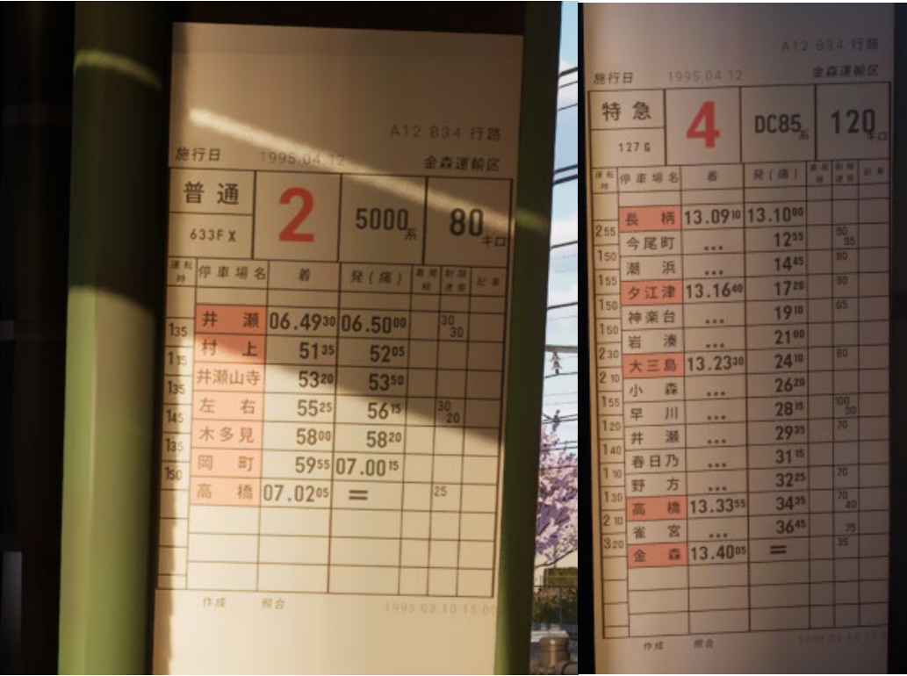

**Fig. 1-1-12:** Driver’s timetable

When you have entered the game, you may discover such a sheet in your cab. This is the driver timetable, which you can know the time, the top speed, and temporary speed limit. Let’s have a closer look.

Basically, the format is shown as below.

**Table 1-1-3:** Driver’s Timetable

| 普 通 | 2 | 5000 系 | 80 キロ |
|---|---:|---|---|
| 633F X |  |  |  |

| 運転時 | 停車場名 | 着 | 発（通） | 着発線 | 制限速度 | 記事 |
|---|---|---|---|---|---|---|
| 1:35 | 井瀬 | 06.49³⁰ | 06.50⁰⁰ |  | 30 / 30 |  |
| 1:35 | 村上 | 51³⁵ | 52⁰⁵ |  |  |  |
| 1:35 | 井瀬山寺 | 53²⁰ | 53⁵⁰ |  |  |  |
| 1:45 | 左右 | 55²⁵ | 56¹⁵ |  | 30 / 20 |  |
| 1:35 | 木多見 | 58⁰⁰ | 58²⁰ |  |  |  |
| 1:50 | 岡町 | 59⁵⁵ | 07.00¹⁵ |  |  |  |
|  | 高橋 | 07.02⁰⁵ | = |  | 25 / 25 |  |

\*Due to software limitation, the leftist row cannot draw the vertical line.

To have a better explanation, we will break it into different parts to explain. First, let’s learn what all these columns mean.

| Train Type | Cars | Loco Type Name | Top Speed |
|---|---|---|---|
| Train Number |  |  |  |

| Running time | Station Name | Arrival Time | Departure/Pass Time | Track (Depot/Station) | Limit Speed | Notes |
|---|---|---|---|---|---|---|

Basically, if you want to know how many cars are there on your trains, just check the red number. In this example, 2 means it is a consist of 2 cars. So basically, from Table 1-1-3, we can know that we are driving a local train with train number 633FX. It consists of 2 cars, and train type is 5000 series, with the top speed of 80 km/h.

And now, let’s read the columns below, namely, this part:

| 運転時 | 停車場名 | 着 | 発（通） | 着発線 | 制限速度 | 記事 |
|---|---|---|---|---|---|---|
| 1:35 | 井瀬 | 06.49³⁰ | 06.50⁰⁰ |  | 30 / 30 |  |
| 1:35 | 村上 | 51³⁵ | 52⁰⁵ |  |  |  |
| 1:35 | 井瀬山寺 | 53²⁰ | 53⁵⁰ |  |  |  |
| 1:45 | 左右 | 55²⁵ | 56¹⁵ |  | 30 / 20 |  |
| 1:35 | 木多見 | 58⁰⁰ | 58²⁰ |  |  |  |
| 1:50 | 岡町 | 59⁵⁵ | 07.00¹⁵ |  |  |  |
|  | 高橋 | 07.02⁰⁵ | = |  | 25 / 25 |  |

We can see “06.49³⁰” here, which equals to 6:49:30. In Japan, seconds are written in a smaller number appears on the top-right of the number for “minute”. In this game, all stations you should stop is marked red, and for limited express, non-stop stations are not marked.

If a train will drive through a station, there will be no time on the “arrival time” row, like the right picture of Fig. 1-1-12 showed. Instead, it will be replaced by “...”. And when a train reaches the end of its operation, you can see a “=” written on the departure/pass row, marking the end of the service.

Track row is used to show which track you will stop at a bigger station, or entering/departing from a depot. You can see it in some scenarios.

Limit speed row here is used to notify whether there are other lower speed limits (than top speed of the train) presented between two stations.

Running time is basically the supposed running time between two stations, which does not require further explanation.

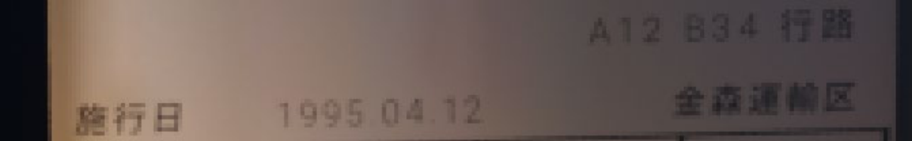

**Fig. 1-1-13:** Above the sheet

One may also find these characters above the sheet. It just shows the date you drive (left) and which “routing” you are driving (top-right), and which depot you belong to (bottom-right).

There is also a line below the sheet, shows the referred diagram of this timetable.

So, I think now you know where to check how many cars there are in your consists, let’s talk about where to stop.

## Where to Stop

With everything discussed above, it is very easy to find where to stop. Simply, a stop position mark looks like Fig. 1-1-14.

**Fig. 1-1-14:** Stop position marker (from: https://rapid221.blog.shinobi.jp/)

(Left: without exact car number, right: with, 4 cars in this case)

There is basically nothing more to talk about on this point, just find out the mark with corresponded number of your train consist if it has one. If not, stop at the left one.

Please understand that in Japan, there are at least more than 1000 people on the platform waiting for a train in rush hours. If you just stop at anywhere you like, you will see 1000+ people running towards you, and probably the force is too strong that your train will be torn apart. So, please stop at the exact position to avoid this happen.

## ATS

Just remember this is a thing that stops you when you did a mistake. 

The ATS alarm is triggered when there's a yellow or red signal ahead. To acknowledge the alarm, *apply brakes* and press the `ATS confirm` button. If there's still some distance to the stop position, you can release the brakes after confirmation.

If not confirmed in time, it will stop you. To restart, push brake to EB, confirm ATS, and restart. But you’d better not as it will certainly let you have a huge delay. ~~(Which is a very serious issue in Japan)~~