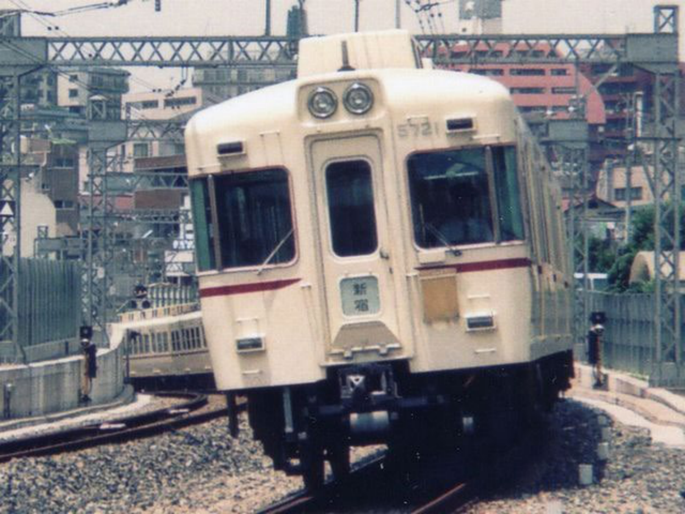
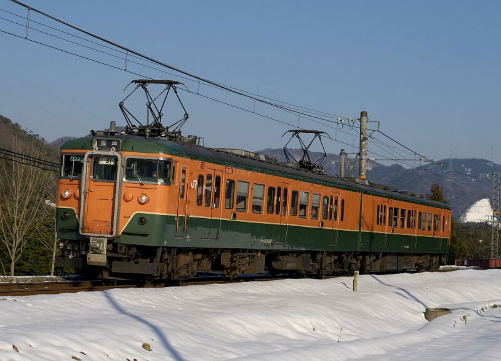
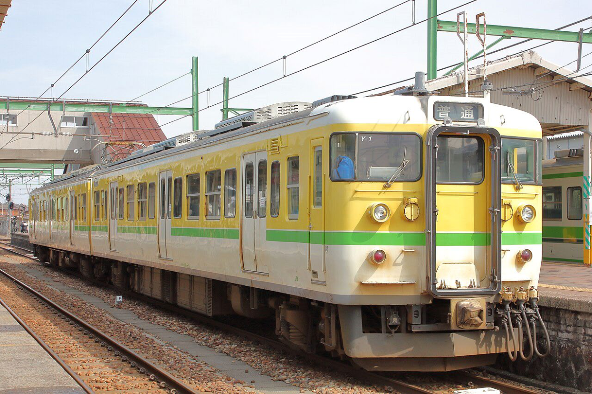
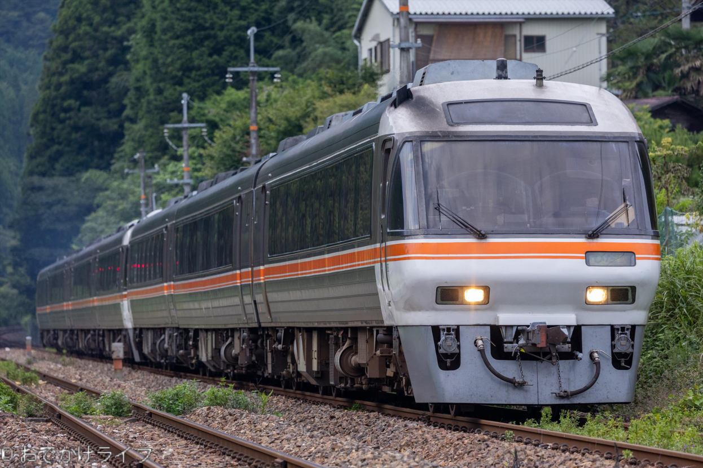

# Chapter 2 - Trains

## KR5000 Series

### Prototype

**Fig. 1-2-1:** Keio 5000 series (I) (1963-1996/2004) (by Cassiopeia sweet)

The original type of this EMU is Keio 5000 series (I), built in 1963 to 1969. 155 vehicles were built, and it was operated until 1996. This was the flagship EMU for Keio, and originally was used for limited express. Later, after 6000 series started operating, it gradually removed from the express operations, but remained operating temporary limited express or express. The EMU's last run is on December 1st, 1996. After that, 8 vehicles were transported to Kotoden, and 1 is placed into Keio's training base. Currently, there was one running on Choshi railway.

In the game, it runs on Fukugawa line. And on that line, there are only Local services, which means you will stop at all stations along the route. The speed limit is quite low, so always make sure to drive follow the hints. Good luck dealing with a 1960s EMU.

### Hints

This is an old EMU, which means it does not have quick response like modern EMUs (E231 & E235). When you are driving it, please remember following points:

1. When you are only about 5-6 km/h away from the speed limit, change your throttle to P3, and N when it's only 3 km/h away.
2. Due to the age, the EMU will continue accelerate for 2-3 km/h, therefore doing something as previous suggested is important.
3. The brake will delay for around 3 seconds, as it requires time to apply brakes. Therefore, brake in advance.

## HR1100 Series

### Prototype

**Fig. 1-2-2:** Kumoha 112-5803 & Kumoha 113-5803 (by EC583)

This is a very rare case of 113 series. Originally, it has only one pantograph, and should be Moha 112 at beginning. Then, it receives reformation, which turns it into cab carriage, and thus becoming Kumoha 112-5803. Only a few 113 series have undergone such reformation process, making it very rare.

### Hints

1. This loco use direct air brake, which means you need to control the brake pressure on your own. Basically, do the followings:
   - Set your handle to brake position (not lap).
   - When it is around 60 to your desired pressure, move handle to lap. (For example, if you want the brake pressure to be 130, switch to lap when it's 70)
   - The operation to add brake pressure from 0 or release it to 0 may take around 5- or 6-seconds delay, so make sure do something in advance.
2. This EMU is not able to move from P4 to P3, instead, return to neutral and go to P3 again.
3. There is also acceleration delay on it, please refer to KR5000 description.

## HR1500 Series

### Prototype

**Fig. 1-2-3:** Kumoha 115-501 & Kumoha 114-501 (by MP40-12C)

In 1984, Echigo Line and Yahiko Line have been electrified, while JNR cannot afford build new EMUs. Therefore, they reform some Moha 115 and turns it into Kumoha like what they did to 113 series. You can see the reference clearly from the picture.

### Hints

This is an old EMU, which means it does not have quick response like modern EMUs (E231 & E235). When you are driving it, please remember following points:

1. When you are only about 5-6 km/h away from the speed limit, change your throttle to P3, and N when it's only 3 km/h away.
2. Due to the age, the EMU will continue accelerate for 2-3 km/h, therefore doing something as previous suggested is important.
3. The brake will delay for around 3 seconds, as it requires time to apply brakes. Therefore, brake in advance.

## DC85

### Prototype

**Fig. 1-2-4:** Kiha 85 Series (from odekate.life)

Built in 1988 to 1992, and complementary build in 1997, Kiha 85 was first used for limited express "Hida", and also used for "Nanki" since March 14th, 1992. This DMU has been removed from operation completely on July 9th, 2023, ending its 35 years services. The basic unit is 4-car, while the maximum consist can be 10-car. Some vehicles are transported to Kyoto Tango Railway, and named as KTR8500 there. You may still see it there.

### Hints

1. It will change gears at 70 km/h and 90 km/h, which may take around 7 seconds.
2. Stop accelerating when it's only 5 km/h away from speed limit. It may add 2 km/h extra after you switch the handle to neutral. (If you are going with full throttle)
3. This is a DMU, so expect postponed reaction to your control.

## General Driving Tips

For a nice stop position, please following this sheet below:

| Speed (km/h) | Distance Left (m) |
|---:|---:|
| 70 | 300 |
| 60 | 200 |
| 45 | 100 |
| 25 | 50 |
| 15 | 25 |
| 5 | 10 |

For a on-time drive through, please following:

| Distance (m) | Time Left (seconds) |
|---:|---:|
| 1500 | 60 |
| 1000 | 40 |
| 400-500 | 20 |
| 200 | 10 |

Besides, when stopping, use B1-B6 when braking, but when it is at a low speed, do not stop with any brake higher than B3.

When departing, before you depart (usually 20s left), move you handle to B4 (pressure shall read about 200-260), and put it to neutral when you hear the buzzer, then move throttle from P1 to P5.

Always drive around 2-3 km/h below the speed limit, but dare to drive rude, many brakes are easier to allow you to lower your speed to the requirement. So, don't be afraid, as that may turn out to be a huge delay.
