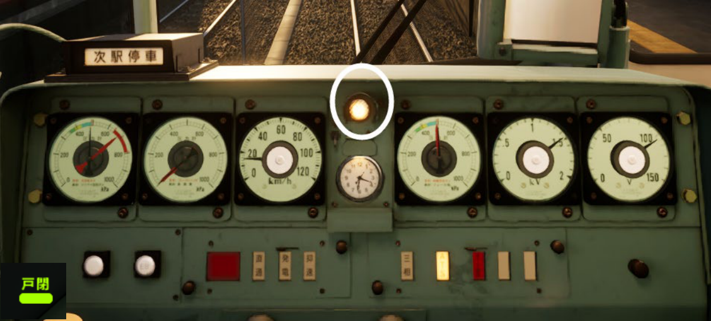
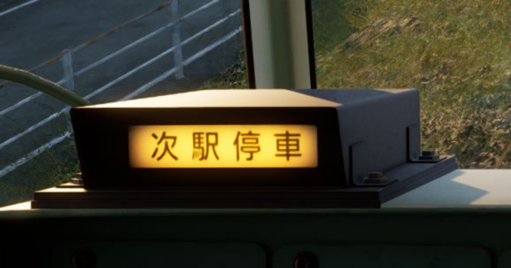

# Chapter 3 - Some Other Devices

## Door-Close Device (*Tojime*)

**Fig. 1-3-1:** Door-Close indicator & how it looks like on HUD

This is a device to detect whether the door is closed. Surely you don't want to throw some people out of your train after departure, right? On HUD, it will turn green (as shown on the bottom-left) when the door closed. And only after you see this, you are allowed to depart.

## Next Station Stop Indicator (*Tsugi, Teisha*)

**Fig. 1-3-2:** Next station stopping indicator

It is just a hint for you to remember you should stop at next station. It usually lights up when there is around 600 meters left to the stop.
