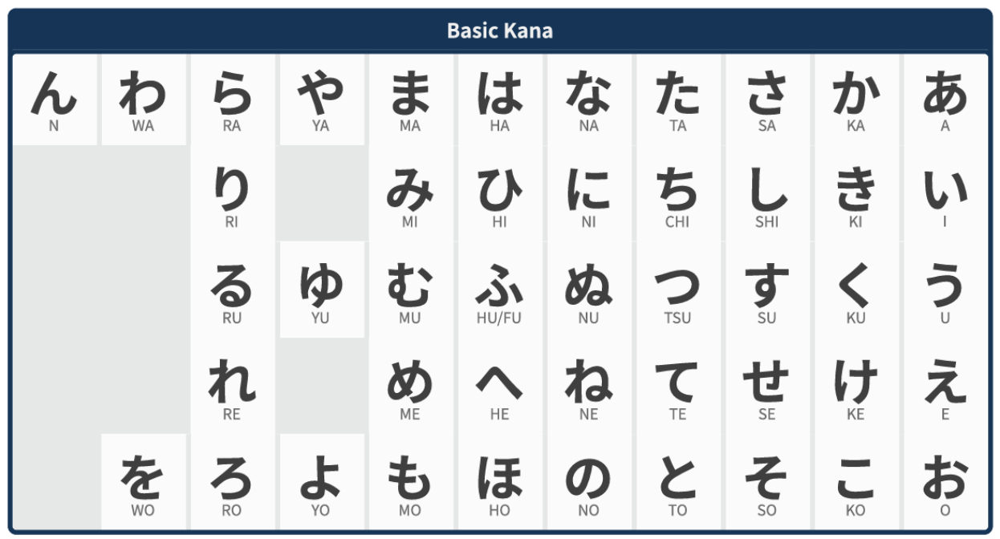
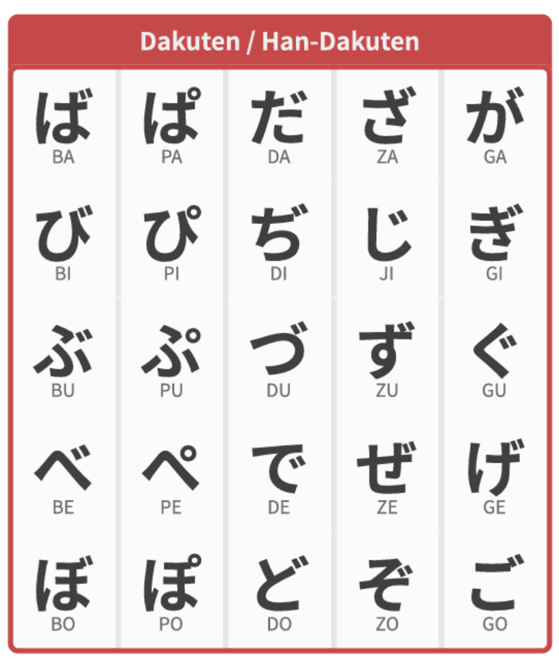
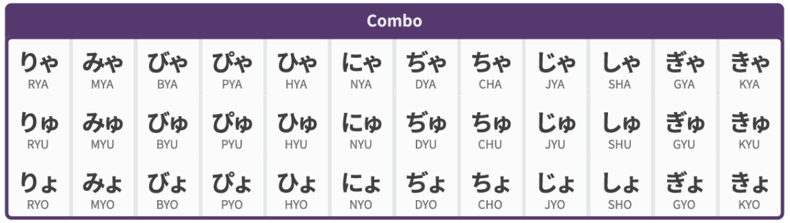

# Chapter 4 - Finger-Pointing (Yubisashi)

Well, this chapter is just for some "nerdy" railfans to behave like authentic Japanese train drivers. We are discussing the *yubisashi kanko* (finger-pointing call, literal translation). Basically, it is a way to confirm things work well. But, before that, we need to quickly look at how to speak Japanese.

## A Small Guide to Japanese (Language)

Don't be afraid, Japanese is quite easy in pronunciation. And since people watching this will not just try to master the language, we will only teach basic pronunciations and omit all phonological rules that is very hard to explain.

### Vowels

| Hiragana | Katakana | Romaji | Reference |
|---|---|---|---|
| あ | ア | a | As in p**a**lm |
| い | イ | i | As in s**ee**d |
| う | ウ | u | As in f**oo**d |
| え | エ | e | As in b**e**d |
| お | オ | o | As in c**old |

All kanas will never change their pronunciations, so just remember it reads basically the same all the time.

### Adding Consonants

There is no need to actually listed reference pronunciation anymore, just pronounce those added consonants the way English did.

**Fig. 4-1-1:** Basic kana

*Just some notes so you don't mess up:*

1. Chi (cheese), Tsu (charts), Wo (out).
2. R here should be pronounced similar to L, not R in *read*.

These are basics, and just like consonants are divided into voiceless and voiced, Japanese use two dots to show voiced version. And for something like *pe*, it's a circle.

**Fig. 4-1-2:** Dakuten / Han-Dakuten

### Smashing Up

And here you smash two up, for example, ki-ya, so you omit ki and make it kya. In this situation, you only pronounce the consonant of the bigger one, and combine it with the full syllable of the smaller one.

**Fig. 4-1-3:** Combo

Now you already know that, and since you are not really just want to master Japanese language, let's omit those stress parts and tone parts.

Long vowels will add a "-" on the vowels, and if you see things like Shup-pa-tsu, this is *sokuon*. Just have a pause between *shu* and *pa*.

For a better understanding, all yubisashi will be listed in three lines: Japanese, Romaji (syllable by syllable), and English meaning of it.

## Departing

*Words in brackets are not necessary, same for every sentence below.*

| Japanese | Romaji | English meaning |
|---|---|---|
| 戸ジメ、点（灯、よし）！ | To-ji-me, ten (tō yo-shi)! | "Door-Close (indicator), (light) on (,confirmed)!" |
| 出発進行! | Shup-pa-tsu-shin-kō | "Departure signal proceed" |
| ○○、発車！（定時！） | (Station's romaji), has-sha! (Tei-ji!) | "(Station name inserted here) station, depart! (On time!)" |

Also, depends on the company or management district, there has other way to say similar things.

## Driving

| Japanese | Romaji | English meaning |
|---|---|---|
| 第〇閉塞、進行/減速/注意/警戒/停止！ | Dai-(number*)-hei-so-ku, shin-kō/gen-so-ku/chū-i/kei-kai/tei-shi! | "The x th block, proceed/reduced speed/caution/restricted/stop!" |
| 制限○○！ | Sei-gen-(speed limit number*)! | "Limited speed is [number]!" |
| 制限解除！ | Sei-gen-kai-jyo! | "Limited speed cancelled!" |

\*1=i-chi, 2=ni, 3=san, 4=yon, 5=go, 6=ro-ku, 7=na-na, 8=ha-chi, 9=kyu

\*10=jū, so 25=2-10-5=ni-jū-go, 70=7-10=na-na-jū

\*100=hya-ku, so 125=100-2-10-5=hya-ku-ni-jū-go

## Arriving/Passing

| Japanese | Romaji | English meaning |
|---|---|---|
| （第〇）場内、進行/減速/注意/警戒/停止！[1] | [Dai-(number*)]-jyo-nai, shin-kō/gen-so-ku/chū-i/kei-kai/tei-shi! | "(The x th) entrance signal, proceed/reduced speed/caution/restricted speed/stop!" |
| ○○、停車、（○両）/通過！[2] | (Station name) tei-sha! [(number) ryo!]/tsū-ka! | "(Station name)" stop, (x-car)!/drive through! |
| 定時！/（定通！） | Tei-ji!/Tei-tsū! | "Stop/Drive through on time!" |

[1] Dai- part only exist when there are more than 1 entrance signal.

[2] This is for entering a station.
